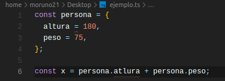

# Diferencias

Imaginemos el siguiente código JavaScript, donde accedemos a la propiedad `atlura` del objeto `persona`, la cual no existe. Vemos que JavaScript nos informa de que "puede que la propiedad atlura no exista" y es cuando ejecutamos el código cuando nos damos cuenta de que tenemos un error.

En TypeScript esto es totalmente distinto, ya que nos informa de antemano de que tenemos un error, no haciendo falta ejecutar el código para darnos cuenta.

