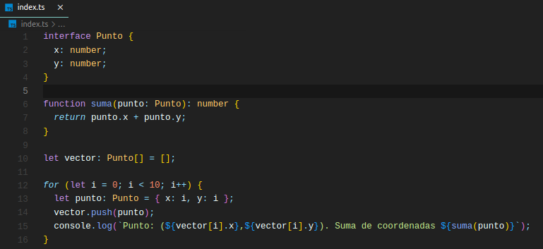

# Proyecto

Después de toda esta explicación, vamos a realizar las configuraciones necesarias para poder trabajar con TypeScript.

## Instalación de TypeScript

Debemos tener instalado TypeScript para poder trabajar con él. Para ello debemos tener instalado node y npm. La instalación depende del sistema operativo, aunque en algunos sistemas Linux (entre ellos Ubuntu) lo podemos hacer desde terminal con los siguientes comandos.

    $ sudo apt update

    $ sudo apt install nodejs

    $ sudo apt install npm

## Creación del proyecto

Una vez realizadas las instalaciones, en la carpeta en la que queramos iniciar nuestro proyecto, introduciremos lo siguiente:

    $ tsc --init

Lo que hará esto es crearnos en nuestra carpeta el archivo de configuración de TypeScript `tsconfig.json`. Este archivo contiene configuración muy variada, como a que versión de ECMASCRIPT se trasnpilará el código, o la carpeta en la que se generará nuestro archivo JavaScript transpilado. Para elegir la carpeta, descomentaremos la línea en la que aparece `"outDir"`, e introduciremos la carpeta donde queramos guardar nuestro archivo transpilado. En nuestro caso lo haremos en la carpeta `./build`. Como esta al principio no existe, se creará automáticamente cuando transpilemos el código TypeScript por primera vez.

Ahora toca crear nuestro archivo TypeScript donde trabajaremos. Mostramos el siguiente ejemplo de código que transpilaremos en el siguiente paso a JavaScript.

## Transpilar a JavaScript

Para transpilar el código a JavaScript, utilizamos el siguiente comando:

    $ tsc --build

Esto lo que hará es generarnos el archivo JavaScript correspondiente en la carpeta que especificamos anteriormente. Vemos que el archivo generado no contiene información ninguna acerca de los tipos.

Cada vez que realicemos algún cambio en el archivo TypeScript, debemos utilizar el comando `tsc --build` para generar el fichero JavaScript correspondiente, lo cual puede ser bastante pesado. Para evitar esto, existe el siguiente comando:

    $ tsc --watch

Lo que hace esto es activar el modo observador (watcher), el cual transpilará nuestro código automáticamente cada vez que guardemos los cambios de nuestro archivo TypeScript.

## Ejecutar nuestro código

Ejecutar TypeScript no es posible, por ello es por lo que lo transpilamos a JavaScript. Para ejecutarlo, hacemos uso de node, el cual lo hemos instalado previamente. El siguiente comando nos permite ejecutar el archivo y ver el resultado por el terminal.

    $ node build/index.js

